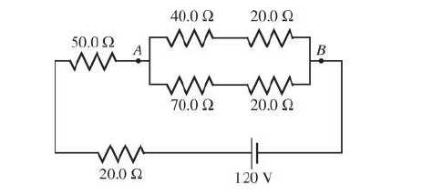

# ResistorClass

7. Write a class called Resistor, It stores a float value represents the resistance value. It contains the following functions: 
a) A one-argument constructor 
b) A zero-argument constructor 
c) A print function to print the resistance value. 
d) A Series function that returns the equivalent Resistor of two Resistors connecting in series. 
e) A Parallel function that returns the equivalent Resistor of two Resistors connecting in parallel. 
f) A Current function that takes the value of voltage across the Resistor and return the value of the current flows inside it. 
8. Write a main function to solve the following circuit returning the equivalent resistance and the current out of the battery. 
   

9. Repeat ex.7 to use operator + instead of series function and operator * instead of parallel function 
10. Rewrite ex.8 using operators +,*. 

